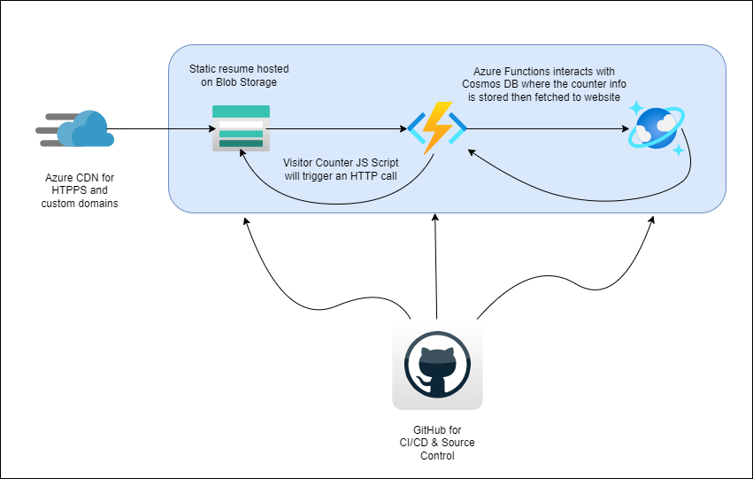

# Cloud Resume Website Challenge
 Here is my approach to the Azure Cloud Resume Challenge.

 View my website [here](https://www.aohfcloudtech.com).

## Prerequisites
- [GitHub Account](https://github.com/join)
- [Azure Account](https://azure.microsoft.com/en-us/free)
- [Azure CLI](https://docs.microsoft.com/en-us/cli/azure/install-azure-cli)

## Cloud Resume Website Challange Diagram 

## Front End

In the FrontEnd folder you will find the resources (HTML,CSS,JavaScript) of the website. The website is static and has a visitor Counter. The Visitor Counter fetches the data via an API call to an Azure Function.

- I used this [template](https://www.themezy.com/free-website-templates/151-ceevee-free-responsive-website-template) to create my site.
- I used this [article](https://www.digitalocean.com/community/tutorials/how-to-use-the-javascript-fetch-api-to-get-data) as reference in making a simple API call.
- I used the following powershell scripts: [BuildAzResources.ps1](BuildAzResources.ps1) and [NewAzCdnProfileandEndpoint.ps1](NewAzCdnProfileandEndpoint.ps1) to deploy Azure Resources needed to host the website.

## Back End

The BackEnd consists of an [HTTP trigger using Azure Functions](https://docs.microsoft.com/en-us/azure/azure-functions/functions-bindings-http-webhook-trigger?tabs=csharp) with Cosmos DB input and output binding. When the function is triggered, it retrieved the item stored in the DB, add 1 to the item, saves it and returns the value to the caller.

- [Create a Cosmos DB account via the command line](https://docs.microsoft.com/en-us/azure/cosmos-db/sql/cli-samples) or [from the portal](https://docs.microsoft.com/en-us/azure/cosmos-db/sql/create-cosmosdb-resources-portal).
- For the Azure Function, I executed [these commands](CreateAzFunctionResource.txt) to deploy the resource through Azure CLI. As for the defining the functions, I used the Azure portal. You can find the function files [here](./BackEnd/VisitorCounter).
- [How to retrieve a Cosmos DB Item with Functions Binding](https://docs.microsoft.com/en-us/azure/azure-functions/functions-bindings-cosmosdb-v2-input?tabs=powershell#http-trigger-id-query-string-ps).
- [How to write to a Cosmos DB item with Functions Binding](https://docs.microsoft.com/en-us/azure/azure-functions/functions-bindings-cosmosdb-v2-output?tabs=powershell).
- I enabled [Cross-Origin Resource Sharing (CORS)](https://docs.microsoft.com/en-us/azure/azure-functions/functions-how-to-use-azure-function-app-settings?tabs=portal#cors) for the Azure functions to allow the website to make an API Call. 

## Testing your code
For Best Practices, you should test your code before deploying it. Here's [how you can tests your functions with PowerShell](https://docs.microsoft.com/en-us/azure/azure-functions/functions-debug-powershell-local).

## CI/CD Resources
- You can find how to deploy a blob storage static site with GitHub Actions [here](https://docs.microsoft.com/en-us/azure/storage/blobs/storage-blobs-static-site-github-actions?tabs=userlevel).
- You can also find how to deploy an Azure function to Azure with GitHub Actions [here](https://github.com/marketplace/actions/azure-functions-action)
